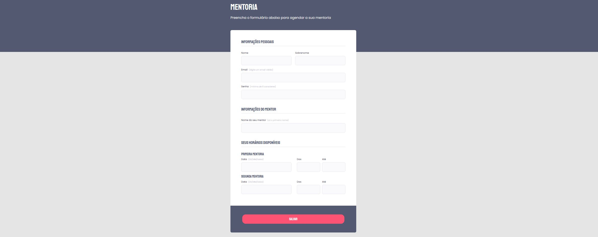

<h1 align="center">Mentoria</h1>

Esse desafio tem como objetivo de praticar sobre formulários. Então, foi proposto o projeto Mentoria da <a href="https://www.rocketseat.com.br/">Rocketseat</a>.  

  <a href="#-tecnologias">Tecnologias</a>&nbsp;&nbsp;&nbsp;|&nbsp;&nbsp;&nbsp;
  <a href="#-layout">Layout</a>&nbsp;&nbsp;&nbsp;|&nbsp;&nbsp;&nbsp;
  <a href="#memo-licença">Licença</a>

  

 

  

## 🚀 Tecnologias

Esse projeto foi desenvolvido com as seguintes tecnologias:

- HTML e CSS
- Git e Github
- Figma

## 🔖 Layout

Você pode visualizar o layout do projeto através [desse link](https://www.figma.com/file/cTTmZodOBxXxOEgSGABhND/Stage-03---Formul%C3%A1rio-intermedi%C3%A1rio-(Copy)?type=design). É necessário ter conta no [Figma](https://figma.com) para acessá-lo.

## 📝 Licença

Esse projeto está sob a licença MIT.

---

Feito com ♥ by Isabela